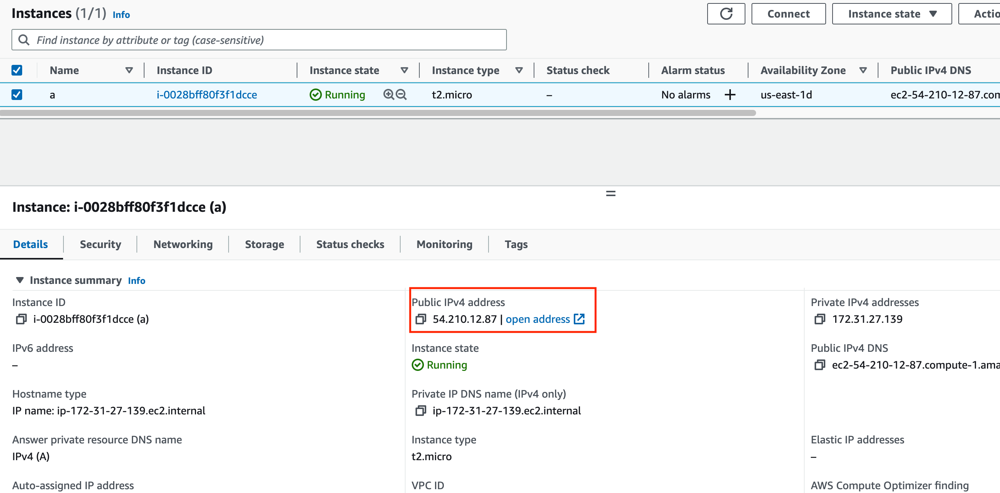
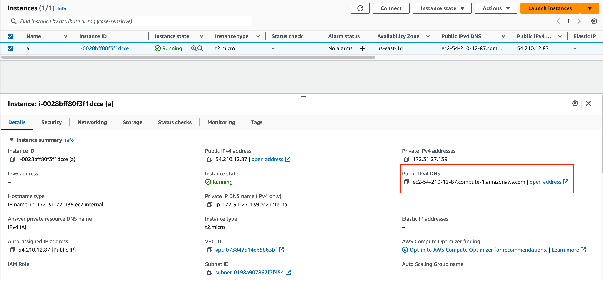

# README

This repository contains the software artifact of the project by Group 8, the main purpose of this project is to test prompt messages and evaluate response time and ability of AI chatbots by asking them various questions.

## Table of Contents
- [Requirements](#requirements)
- [Environment](#environment)
- [Setup](#setup)
- [Files](#files)
- [Asking Code Questions](#asking-code-questions)
- [Run the Code](#run-the-code)
- [Results](#results)

## Requirements

- EC2 instance with t2.micro, Ubuntu 20.04, 8GB disk

## Environment

- Python 3.10.6

## Setup
the following tutorial is run on **Unix**, if you are using **Windows**, you can use **mobaXTerm** to connect the instance via ssh, here is the [tutorial](https://sites.google.com/sunke.info/sunkemedia/hosting-service/how-to-connect-to-aws-ec2-instance-using-mobaxterm?pli=1)

**Before setting up, ensure you have downloaded zip file source from this repository, and replace your keys in both** `benchmarkAllCoding.py` and `benchmarkAllQuestion.py`
```python
POE_KEY = "POE KEY"
CHATGPT_KEY = "CHATGPT KEY"
BARD_KEY = "BARD KEY"
```
**AND**
`cookies.json` for bing AI chat by following steps to obtain secret key from:
- **ChatGPT**: [How to Find your OpenAI API key for ChatGPT](https://help.socialintents.com/article/188-how-to-find-your-openai-api-key-for-chatgpt)
- **Poe**: [ading2210/poe-api#finding-your-token](https://github.com/ading2210/poe-api#finding-your-token)
- **Bard**: [acheong08/Bard#authentication](https://github.com/acheong08/Bard#authentication)
- **Bing**: [acheong08/EdgeGPTPublic#getting-authentication-required](https://github.com/acheong08/EdgeGPT#getting-authentication-required)

### Steps
1. Create the EC2 instances, using the specification in [requirements](#requirements)

2. Open two terminal windows: one for connecting to the instance using ssh connection, and one for file transfer
3. Use terminal one, connect to the EC2 instance using
```
ssh ubuntu@{instance ip address} -i {key}
```
`instance ip address` can be found in "public IPv4 address" after the instance is created, which can be found here:

`key` is the key you assigned to the instance for ssh connection.
4. Use terminal two, go to the folder where **key and the github source(zip file)** is stored using `cd` command, transfer the downloaded source to EC2 using 
```
scp -i {key} {zip} ubuntu@{DNS address}:{name}
```
`key` is the key you assigned to the instance for ssh connection
`zip` is the zip file location(github source)
`DNS address` is the instance's public DNS address, which can be found here:

`name` is the target desination in the instance
5. Back to terminal one, Update the apt using
```
sudo apt update
```
6. Install unzip using 
```
sudo apt install unzip
```
7. Unzip the transferred zip file using 
```
unzip {zip file}
```
8. Install pip3 using 
```
sudo apt install python3-pip
```
9. Navigate to the unzipped file using `cd`
10. Install required packages using 
```
pip3 install --upgrade -r requirements.txt
``` 

## Files

- `benchmarkAllQuestion.py`: Test prompt message with provided argument
- `benchmarkAllCode.py`: Test coding ability by asking LeetCode questions (see tutorial below)
- `codingQuestionAnswer` directory:
  - `BotNameAnswer.py`: Store the code answer by AI chatbots
  - `LeetcodeQuestion.txt`: The prompt to be asked
  - `ResponseTime`: Store the recorded response time of each chatbot
- `CommonQuestionAnswer` directory:
  - `output.txt`: Store the answer by each bot, and the response time of each bot

## Asking Code Questions

1. Go to [leetcode.com](https://leetcode.com/)
2. Find a question
3. Copy the question, type **"TASK: finish {THE def TO BE FINISHED} in python3, no explanation needed, provided code:"** and copy the provided code to `LeetcodeQuestion.txt`

## Run the Code

- For message prompts: Use 
```
python3 benchmarkAllQuestion.py "{prompt}"
``` 
- For code prompts: Use 
```
python3 benchmarkAllCoding.py
```

## Results

The results will be printed in the **console** and written to the corresponding files in `codingQuestionAnswer` and `CommonQuestionAnswer`.